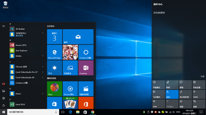
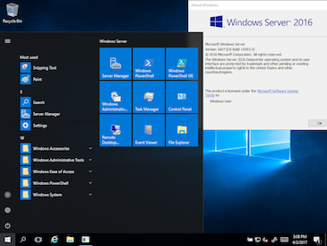
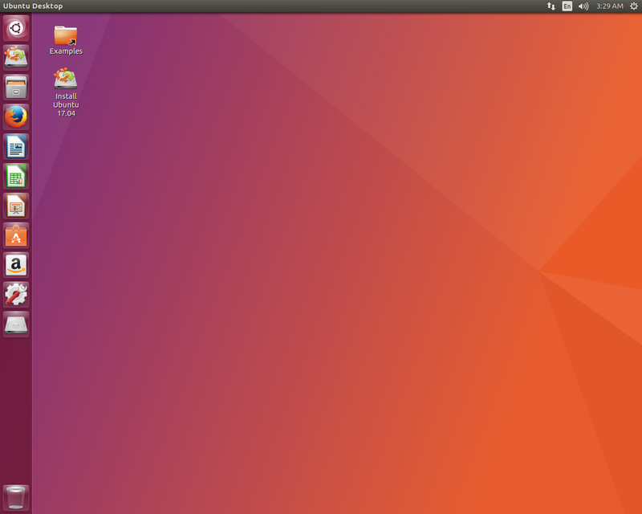
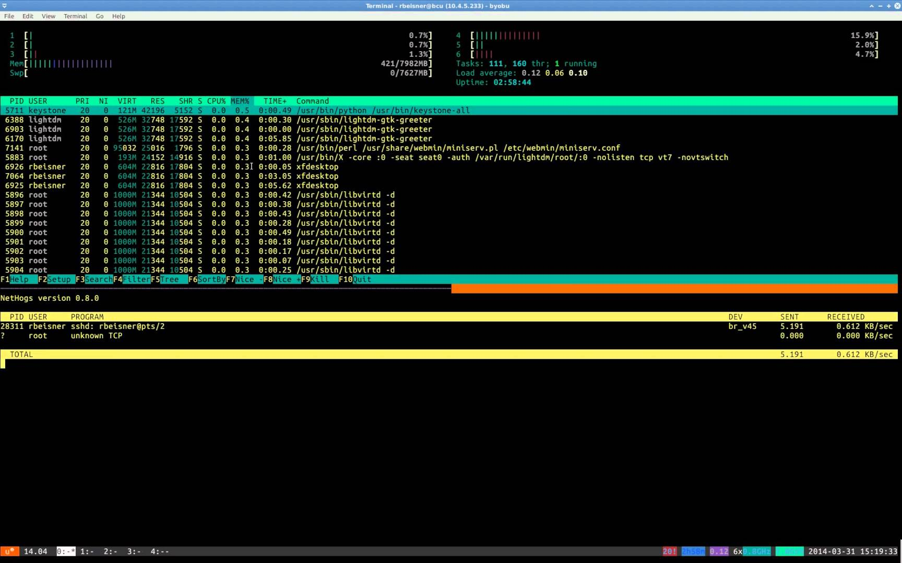

##PC和服务器操作系统

现在主流的桌面操作系统有Windows,Mac OS，占有少量的还有Linux

### Windows
Windows是微软(Microsoft)公司开发的用户友好的操作系统，适用于目前市面上的绝大多数设备，在目前也占有绝大多数的桌面市场（高于80%），广泛应工作，教育，工业，科研等各个场合，在本书写作的时候，最新的Windows发行版本为Windows 10。

Windows 10操作系统

Windows也有使用服务器版本的操作系统Windows Server，由于提供了很多便于管理的图形界面工具，使得很多专业知识不多的用户，也能够方便的管理服务器,因此Windows在服务器市场也占有一定的比率。

下图展示的Windwos Server 2016操作系统界面和Windows 10存在较大的相似性，实际上它是Windows 10操作系统的一个部分，做了部分改使得更加适用于浏览器环境。

Windows Server操作系统

### macOS
macOS在2012年之前称为Mac OS X,2012-2016年称为OS X,之后为了和其他产品(iOS,watchOS,tvOS)统一,称为macOS,最新版本在写书时为mac OS 10。macOS是由苹果(Apple)公司研发的操作系统，和其生产的mac硬件设备相绑定，桌面占有率占据第二，大约为10%，目前常见于科研工作人员，开发设计者，以及教育相关的群体中。

> macOS因为较简洁先进的UI设计，吸引了很多一片用户。尤其在国外很多高校，macOS几乎已经成为学生的标准配置。macOS也是基于UNIX的操作系统，他采用了UNIX的一个分支freeBSD修改的Darwin开发而成，使得UNIX这类复杂和使用门槛较高的操作系统也有了一个非常优秀和友好的用户环境。

macOS

### Linux
Linux是一套开放源代码(Open Source)的操作系统，基于这个衍生了很多免费和开放的操作系统，如Ubuntu,CentOS等，前者常见于服务器和个人桌面电脑，后者常见于服务器设备。Linux由芬兰的大学生Torvals Linus开发，由世界上黑客志愿者们共同维护，目前已经成为了世界上最大的优秀开放源代码项目(超过100万行的c语言代码)。Linux的Logo和吉祥物是一只企鹅，如下图所示。

Linux的吉祥物Tux

> Linux吉祥物是企鹅据说是因为他的主要开发者Torvals Linus曾经被企鹅咬过。如果你有仔细观察，你会发现这只企鹅的左手(右边)居然放在他的脚丫上，关于这个也有一段很有意思的趣闻。你可以搜索GNU项目和Rechard Stallman来了解这个组织和这个计算机天才的趣事。

> 实际上电影中绝大多数黑客使用的操作系统，都是Linux,Linux本身就是一群天才的电脑Geek们共同维护的系统。如经典的电影《黑客帝国》中女主角崔尼蒂用来入侵远程系统的sqlmap程序以及破解Wi-Fi时用的Aircrack-ng程序,在现实世界中的安全圈就非常有名。如果你对计算机安全感兴趣，那么Linux将会是很好的一个操作系统，你可以通过搜索Kali Linux等关键词来获得很多内容。

当然Linux系列操作系统由于桌面环境的相对的不完善以及软件生态的原因，以及对使用者有较高的要求(如你在电影里看到的，大多数操作都需要靠输入命令来完成)，因此用户数量较少。Linux常被用与科研工作，大型计算，以及服务器。此外，国内也有基于Linux修改的适合国人的桌面操作系统，如Ubuntu Kylin以及深度公司开发的Deepin。

Ubuntu 17.04桌面操作系统

## 大型服务器和超级计算机操作系统
绝大多数大型服务器，甚至包括微软(他们生产了Windows Server)的Azue云服务，都大量运行了Linux服务器操作系统。其中值得一提的是Red Hat公司开发的商业版本Red Hat  Enterprise Linux，因为其商业支持以及稳定性(Linux服务器相对于Windows服务器的一个很大的优点是Linux支持热更新，即更新不用关机重启，而且速度很快，使得服务器可以保持长时间开机不至于服务中断)，为很多航天，工业，政府网站提供了可靠稳定的服务。

Linux服务器

而世界上绝大多数超级计算机也是基于Linux操作系统

