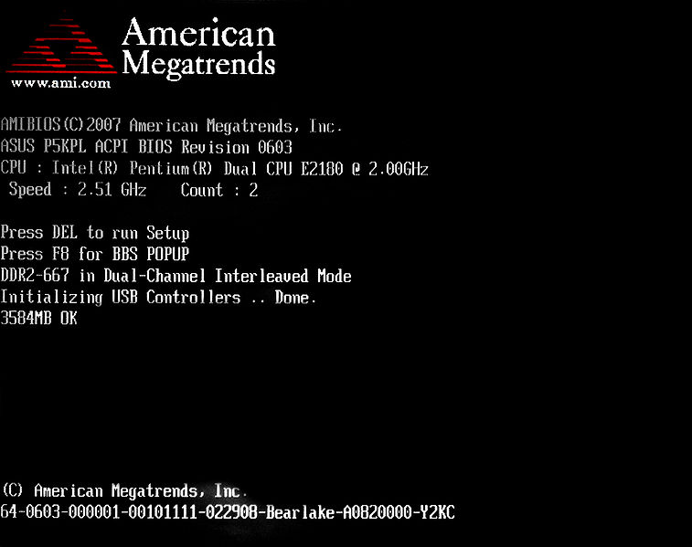
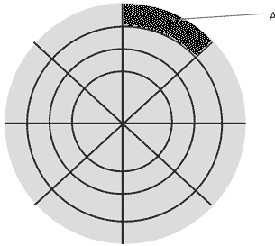
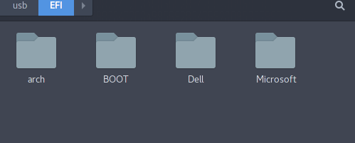
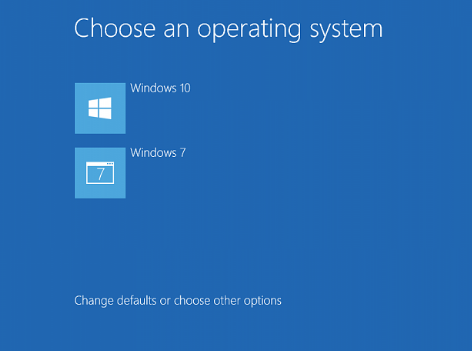
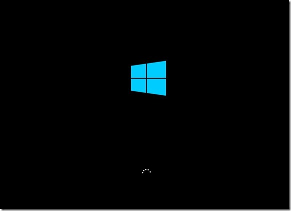


## 操作系统 - 概述
操作系统的启动是一个很复杂的过程，本部分我们将避免直接平铺直述或引入大量有关操作系统的术语，而是通过分析加上图片辅助来了解Windows等操作系统的工作机制，来使得读者借助使用和分析常见的操作系统,对操作系统有一个比较深入的理解。并最终通过自己的实际动手，来完成一系列的工作

### Windows操作系统启动过程

#### 从开机开始 - 按下开机键之后发生了什么

###### 开机自检 - BIOS
首先，开机键按下的时候，电源启动，主板开始运行开机自检程序，即POST(Power-On Self Test)，在此期间会检查CPU,内存条，存储设备是否正常工作,如果错误将报出错误信息，正常则开始下一步。大多数现代计算机设备开机的时候都会出现Post画面，内容一般为厂商的Logo和一些系统信息。

POST界面的一个示例

而这个开机自检的过程由一个特殊的程序- BIOS程序完成，BIOS程序由设备制造厂商开发并写在主板上，他和你使用的是Windows或者Linux操作系统无关。BIOS即基本输入输出系统(Basic Input/Output System)，他系统了系统很基本的一些功能。通过BIOS Setup程序（需要我们在开机时按住特定的按键来进入）我们也可以对一些常用的系统硬件参数进行设置，比如主板时钟的时间等，调整启动设备的顺序等。

BIOS界面的一个示例

###### 操作系统的源头 - MBR
BIOS程序在检测完毕之后，将会从事先预设的第一启动设备(一般为硬盘)中加载MBR程序,BIOS程序完成工作，就会把控制权转交给MBR程序，我们假设启动设备为硬盘，那么MBR（主引导记录Master Boot Record）程序就位于硬盘的第一个扇区前512字节。

> 当年广泛传播的病毒CIH就是因为向硬盘首部开始写入大量空数据，造成MBR程序以及其他内容被破坏，从而导致系统无法开机的。

MBR(黑色部分)在硬盘上的位置

> 为了查看MBR程序的内容，我们可以使用Windows下Encase或者DiskGenius以及Linux下面的hexdump等工具对硬盘的第一扇区内容进行查看,如果你有汇编语言的知识，你甚至可以通过工具逆向出MBR程序的具体内容。

实际上，近几年来，大多数的计算机主板采用了一种新的模式来替代MBR，这种技术称之为UEFI。所不同的是，UEFI依赖的是一个FAT32的文件系统，主板通过读取这个分区的/EFI/Boot/Bootx64.efi程序，来达到进一步启动系统的目的。由于这种启动方式是建立在一个分区上的，UEFI程序的规模一般可以更大，从而具有更多的功能特性。

而UEFI分区在Windows下面默认是不挂载的，我们可以通过诸如Disk Genius等程序访问，可以在ESP卷标的分区中找到上面提到的UEFI程序。

笔者提取的UEFI分区的文件

###### BootMgr
MBR或UEFI程序完成一些基本工作后，定位到BootManager的位置，并将权限转交给它。BootMgr(BootManager的***匈牙利命名法***缩写)程序会读取BCD记录，用来管理多个操作系统共存的局面，从而选择启动特定的操作系统,当然也可以用来使Windows以安全模式来启动。

> Windows的安全模式下，驱动被禁用，开机自动启动的软件和服务也会被禁用，在这个模式下可以查找因为一些恶意软件和驱动更新造成的系统无法启动。

安装多个系统时弹出的BootMgr系统界面

###### Windows NT内核
当Windows系统被默认启动后，系统控制权就从BootMgr被转交给Windows系统内核。从XP以后，Windows操作系统均使用了Windows NT作为内核。NT内核从文件C:\Windows\System\ntldr启动，之后整个Windows系统就开始工作了。

Windows启动画面

###### 总结
整个操作系统的启动就是一个控制权转交的过程，可以总结如下

POST(开机自检) -> MBR/UEFI程序 -> BootMgr -> 内核

##### 小试验
- 根据你的电脑型号，通过搜索引擎查询你的电脑进入BIOS的方法（常用的有F2,F11,F12,Delete,Enter）,尝试查看并根据英文理解一些BIOS参数的意思

